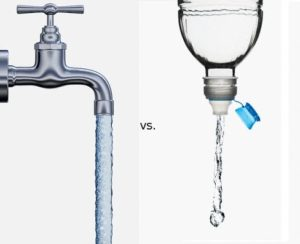

<!-- This won't be displayed but it will initialize your R session. Add any R libraries you need here. -->
```{r init,include=FALSE,echo=FALSE}
library(magrittr)
```


# Great Ideas Need a Place to Grow

<!-- You can include images saved within your repo... -->
```{r hello-world,echo=FALSE,fig.cap='Can we change the way people think about water?',fig.align='center',out.width='50%'}

```

This semester saw more twists and turns that I expected. I'll admit, some technical reading that pulled apart quarks in an atom. Others, well, I didn't expect that plane to land on cartoon wheels. In all, this superseded expectations. Great classmates, great conversation, great thinking, and great fun. Looking forward to continuing with you all on this journey. And am looking forward to a wonderful conclusion to this course. 

I hope to work with you on my project!

<!-- Below this line is just examples of how you can embed video from Google Drive. First you have to enable sharing, then just get the object ID which is that long string between d/ and /preview and will also be appended to any sharing link you generate for your video. -->
<p>
```{r hello-benji,echo=FALSE,fig.cap='Dont Hesitate - Vote HYD8!',fig.align='center'}
knitr::include_url('https://drive.google.com/a/berkeley.edu/file/d/1PNiz07Vw756Cj1WYqOVmf67wtm2TdBRh/preview')
```

### HYD8 - Water to Go

I'm really excited about this idea. Despite public water sampling across the country, there is no easy way for individuals to tell the quality of their tap water. This uncertainty leads many to buy expensive bottled water that may or may not be better quality. What if we could help bring data together to inform users to make better decisions? What if that information helped consumers in places like Flint or Houston know water wasn't safe? Or consumers in NYC to know their tap water is better than what's in the bottle? Small changes could impact health and environment alike.

I think it's possible and probable that this idea gains traction outside of this course. I'd love to join with you to help see how we together expand this idea and see if it can take root into something real!

### Campaign Chemistry

My wife is a fashion agent – meaning she helps models, photographers, and clients (think Vogue or Target) create campaigns for their new products. This process of matching ideas, looks, and people to make something impactful in the market rests nearly entirely on gut instinct of a few people.

This idea stems around pulling data such as trends in fashion data, success of product and photographer, and social network reach of the models to help give a possible influence score of the mix of inputs. This score would help designers or art directors make informed decisions on which teams to pair on projects. 

Who knows – this idea and your help could end up on a billboard in Times Square!?!
 
## About the author {Dave Owen}

Dave is a strategy and finance consultant at a boutique consulting firm called Berkeley Research Group. An apt name – BRG was founded by Professor David Teece in the Haas School of Business. 

Dave focuses on leading organizations through critical transformations — helping create sustainable inflection points that launch a new trajectory for teams and companies. He has 15 years of experience working in a variety of industries and international geographies. 

He grew up in Colorado and is an avid fly fisherman (hence the interest in clean water). He went to Cornell University to gain his undergraduate degree in engineering and attended NYU for business school. Dave has been fortunate to have lived Milan, Munich, and Vancouver as an adult. He currently lives in Brooklyn with his wife Winter and dog Sage.


*Updated: `r Sys.Date()`*
